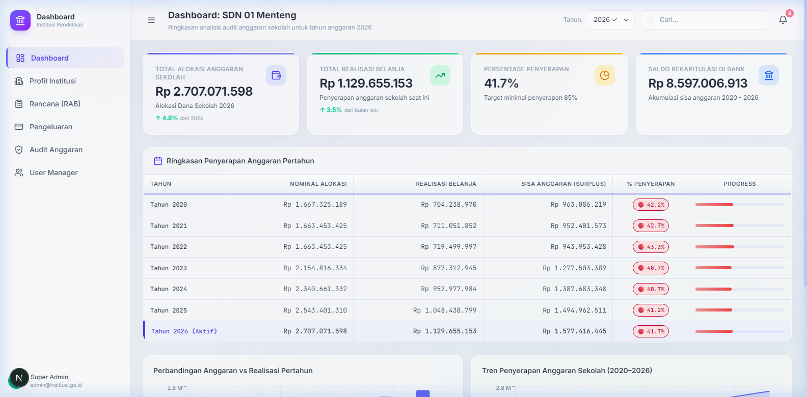
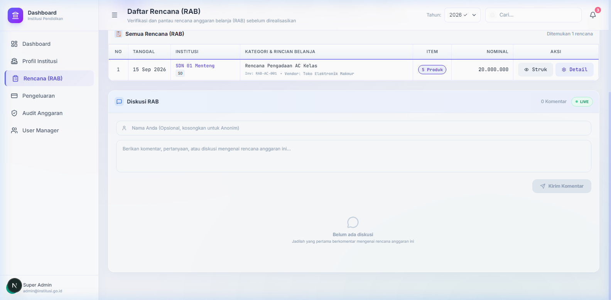
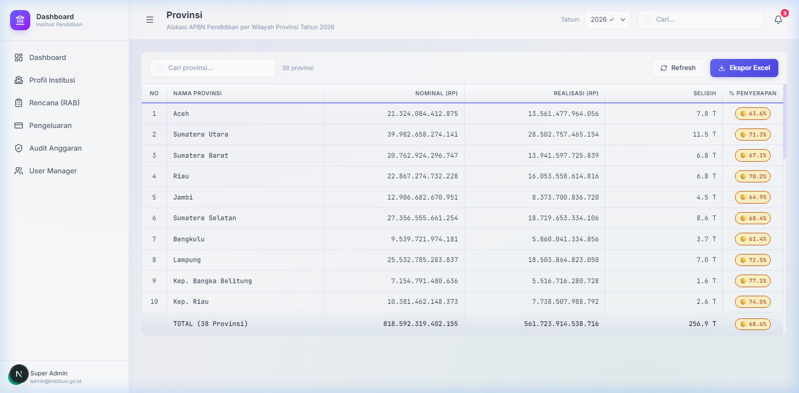

# Dashboard Institusi 🇮🇩

Sistem informasi modern bergaya *spreadsheet* untuk pemantauan, alokasi, transparansi, dan audit Anggaran Pendapatan dan Belanja Negara (APBN) di sektor Pendidikan Indonesia. 

Aplikasi ini menyajikan *dashboard* dengan performa tinggi yang memungkinkan instansi terkait (mulai dari tingkat nasional hingga daerah) memantau alokasi vs realisasi anggaran secara berjenjang dan *real-time*.

## 📸 Tangkapan Layar Aplikasi (Localhost)

### 1. Dasbor Utama (Ringkasan APBN)


### 2. Papan Rencana Anggaran Belanja (RAB) & Diskusi Realtime


### 3. Alokasi Per Provinsi (Spreadsheet Interface)


---

## ✨ Fitur Utama

- **Navigasi Berjenjang (Hierarki)**: Pemantauan dana mulai dari **APBN Nasional ➔ Provinsi ➔ Kabupaten/Kota ➔ Jenjang Pendidikan** (Universitas, SMA, SMP, SD, PAUD).
- **Antarmuka Bergaya Spreadsheet**:
  - Input data nominal dan realisasi secara langsung *(inline editing)*.
  - Perhitungan **Selisih** dan **Persentase Penyerapan** otomatis (kaskade) dari bawah ke atas.
- **Visualisasi Data**: *Dashboard* analitik dengan metrik utama dan grafik tren tahunan menggunakan *Recharts*.
- **Desain Modern (Glassmorphism)**: UI/UX premium dengan *Light Mode*, efek *frosted glass* (transparan-blur), serta aksen warna yang halus.
- **Manajemen Pengguna (RBAC)**: *Role-Based Access Control* (Super Admin, Admin Provinsi, Auditor, Viewer, dll.) dengan kontrol status aktif/non-aktif.

---

## 🛠️ Stack Teknologi

Sistem ini dibangun menggunakan ekosistem *web modern* dengan performa tinggi:

- **Framework**: [Next.js 16 (App Router)](https://nextjs.org/) & React 19
- **Bahasa**: TypeScript (Strict Typing)
- **Styling**: [Tailwind CSS v4](https://tailwindcss.com/) dengan arsitektur variabel berbasis `@theme`.
- **State Management**: [Zustand](https://github.com/pmndrs/zustand)
- **Ikon & Grafik**: Lucide React & Recharts
- **Font**: Inter (Google Fonts)

---

## 📂 Struktur Proyek

```text
dashboard-institusi-pendidikan/
├── app/                  # Next.js App Router (Halaman & Layout)
│   ├── dashboard/        # Halaman utama aplikasi (APBN, Provinsi, Kab/Kota, dll.)
│   ├── globals.css       # Root stylesheet (Tailwind v4 tokens & utility classes)
│   └── layout.tsx        # Root layout (Provider & Font)
├── components/           # Komponen UI Reusable
│   ├── layout/           # Sidebar, Header, Shell
│   └── ui/               # PctBadge, StatusBadge, MetricCard, dll.
├── lib/                  # Utilitas dan Data
│   ├── data/             # Mock data deterministic & generator
│   ├── store/            # Global state (Zustand)
│   └── utils/            # Fungsi format mata uang, persentase, class merger (clsx)
├── PRD/                  # Kumpulan Product Requirements Document (Master)
└── types/                # Definisi tipe data TypeScript (Interface)
```

---

## 🚀 Memulai Pengembangan (Development)

Pastikan Anda memiliki [Node.js](https://nodejs.org/) (versi 18+ disarankan) terinstal di sistem Anda.

### 1. Clone repository ini
```bash
git clone https://github.com/adimaryanto-stack/Dashboard-Institusi-Pendidikan.git
cd Dashboard-Institusi-Pendidikan
```

### 2. Install dependencies
```bash
npm install
# atau
yarn install
# atau
pnpm install
```

### 3. Jalankan Development Server
```bash
npm run dev
```

### 4. Akses Aplikasi
Buka [http://localhost:3002](http://localhost:3002) di browser Anda. Halaman utama adalah rute `/dashboard`.

---

## 📖 Dokumentasi Lengkap & Riwayat Rilis

Dokumentasi rancangan produk, arsitektur, peta jalan (*roadmap*) pengembangan, serta riwayat perubahan sistem dapat diakses melalui berkas berikut:

- **[`PRD/MASTER_PRD.md`](./PRD/MASTER_PRD.md)** — Dokumen Persyaratan Produk (PRD) Konsolidasi.
- **[`PRD/MVP_Roadmap_v2_Spreadsheet.md`](./PRD/MVP_Roadmap_v2_Spreadsheet.md)** — Roadmap Pengembangan MVP Fitur Spreadsheet.
- **[`CHANGELOG.md`](./CHANGELOG.md)** — Catatan lengkap rilis versi dan daftar perubahan fitur.

---

## 🛡️ Lisensi & Kepemilikan

Proyek ini merupakan purwarupa (*prototype*) untuk inisiatif transparansi anggaran. Dikembangkan untuk keperluan internal instansi terkait.
